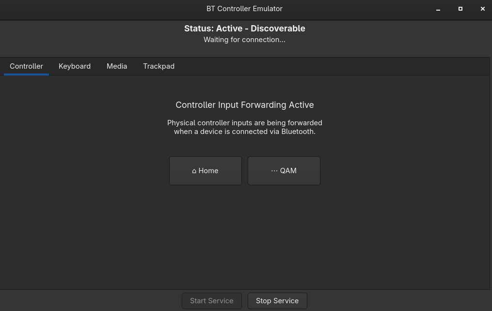
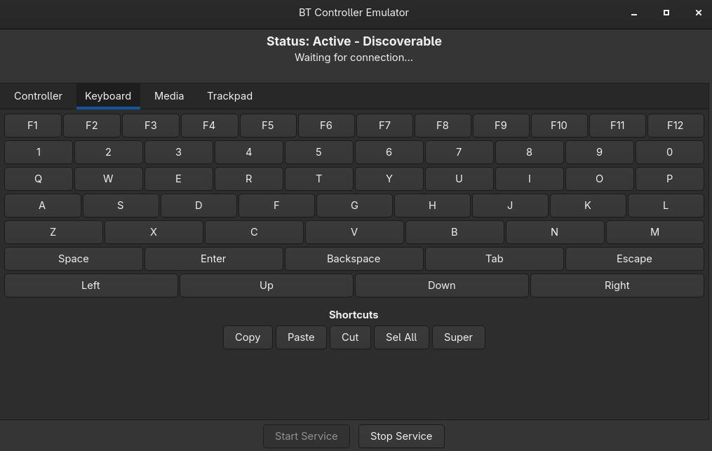
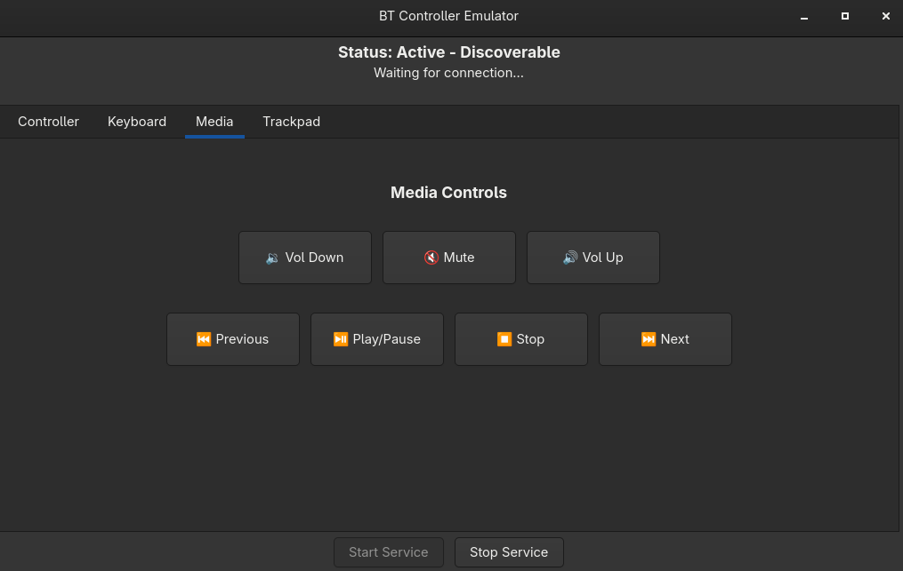
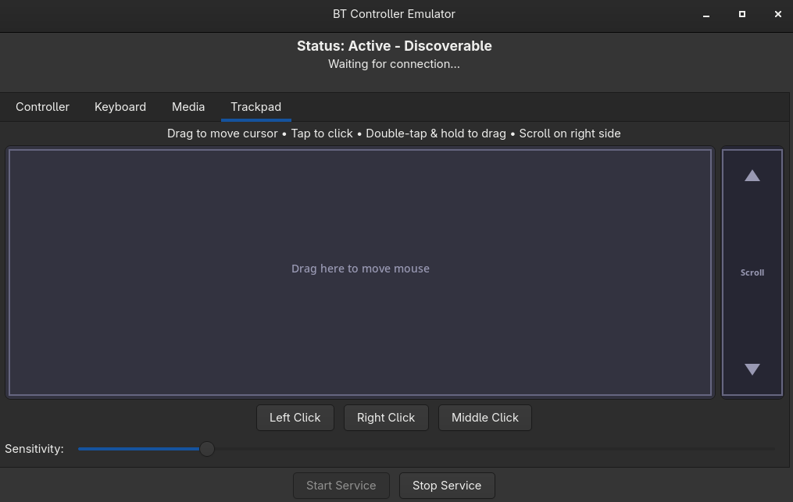

# Steamin Ma HoG

Emulates a Bluetooth LE gamepad peripheral that forwards controller input from a Steam Deck to other devices. Not only that, but you also get full keyboard, trackpad, and media controls tabs. 

   

This is a HID-over-GATT profile implementation using BlueZ D-Bus APIs. Primarily built with Steam Deck and Steam OS in mind, but other linux devices could take advantage too, just be sure to install any dependencies the install script may complain about not having.

## Installation

Do Not Blindly Run Scripts You Find On The Internet! Review its contents first!

Copy the following script and paste into your terminal (konsole on Steam Deck).

```bash
curl -fsSL https://raw.githubusercontent.com/xXJSONDeruloXx/steamdeck-bt-controller-emulator/main/install.sh | bash
```

Installs to `~/steamdeck-bt-controller-emulator`. Creates desktop launcher, configures Bluetooth and input permissions. Log out and back in after first install.

I recommend right clicking/long pressing on the app or the desktop shortcut and adding to steam, from there you can take advantage of steam input for things like gyro, back buttons, dual trackpads etc.

Update by running the same command. Uninstall with `cd ~/steamdeck-bt-controller-emulator && ./uninstall.sh`.

## Usage

Launch from application menu, desktop shortcut or run `python3 -m src.hogp` directly. GUI provides connection management and input monitoring. 

When application is open, press "Start Service", then on the device you want to control, open bluetooth settings. You shpuld either find something named SteamDeckPad or BlueZ 597. Connect to this and follow the prompts on both devices. 

After a few seconds, the device should now recognize an hid controller over bluetooth, as well as a keyboard and mouse hid device. 

CLI mode available for testing without `--gui` flag. Use `--forward /dev/input/eventX` to map physical controller.

## Troubleshooting

- if you make the connection to the computer but steam does not recognize any controller, first try a reboot (especially if you have not logged out/rebooted since first install). If you still have issues, try forgetting both the deck from the PC and the pc from the deck in their respective bluetooth settings.

- When pairing, be sure on both devices to affirm the pin matches when asked, generally I find acknowledging on the PC first, then steam deck second is the best way to go, but it shouldn't matter much

- on first pair, you will probably have to jump into controller config settings in steam and do the mapping routine, things like triggers and bumpers may not map exactly right by default but all inputs are exposed so Steam can assign to the right places. skip guide and qam buttons, those are mapped inside the GUI rather than the physical controllers pass through (since the actual decks guide and qam are reserved for its nav needs).

## Development

`just deploy` syncs to Steam Deck over SSH (be sure to change the ip). `just run` executes remotely. `just logs` tails system logs. Source in src/hogp includes bluez.py (D-Bus interface), gatt_app.py (HID service), input_handler.py (evdev forwarding), and gui.py (GTK4 interface).

## References

[EmuBTHID](https://github.com/Alkaid-Benetnash/EmuBTHID), [BTGamepad](https://github.com/007durgesh219/BTGamepad), [diyps3controller](https://github.com/rafikel/diyps3controller), [GIMX](https://github.com/matlo/GIMX) 